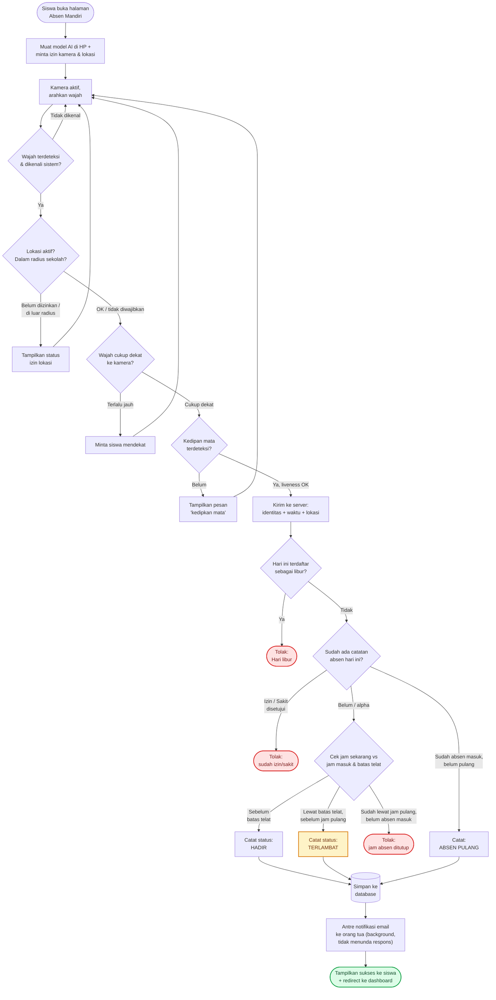

# Alur Absen Mandiri (Bahan Demo & Presentasi)

> Diagram alur absen mandiri siswa lewat HP — dari kamera menyala sampai
> tercatat di database, termasuk seluruh pengecekan yang berjalan di
> belakang layar (lokasi, waktu, dan verifikasi kedipan).
>
> **Besok:** demo ke pengajar. **Minggu depan:** presentasi ke guru.

## Diagram Alur Lengkap (Client → Server)

**Legenda:** kotak putih = proses/pengecekan, hijau = berhasil tercatat,
kuning = tercatat dengan catatan (terlambat), merah = ditolak/tidak tercatat.

Baris atas (sampai "Kirim ke server") berjalan di HP siswa secara real-time,
100% di browser — tidak butuh koneksi ke server sampai satu langkah terakhir.
Baris bawah berjalan di server, dieksekusi dalam satu request yang sama
(lihat `app/Services/AbsensiRecorder.php`).

## Poin Kunci untuk Disampaikan

1. Pengenalan wajah & hitung jarak dilakukan **langsung di HP** (on-device), bukan dikirim ke server — lebih cepat & lebih hemat data.
2. Kedipan mata dipakai sebagai **verifikasi hidup** (liveness) — mencegah absen pakai foto statis di layar/kertas.
3. Lokasi GPS opsional bisa diaktifkan admin untuk membatasi absen hanya dari radius sekolah.
4. Status hadir/terlambat/pulang dihitung otomatis dari jam pengaturan sekolah, tidak perlu input manual.
5. Notifikasi email ke orang tua dikirim di belakang layar (queue) — tidak membuat siswa menunggu.

## Checklist Sebelum Demo

- [ ] Izin kamera & lokasi browser sudah diberikan di HP yang dipakai demo
- [ ] GPS / Location Service HP menyala (kalau fitur lokasi aktif)
- [ ] Wajah demo sudah terdaftar di sistem (sampel wajah tidak kosong)
- [ ] Pencahayaan cukup terang, wajah menghadap lurus ke kamera
- [ ] Server & queue worker (email) berjalan sebelum sesi dimulai — `php artisan queue:work` atau `composer run dev`

## Catatan Teknis

Seluruh tahap deteksi & verifikasi di HP berjalan dalam hitungan ratusan
milidetik setelah dioptimasi khusus untuk perangkat kelas bawah (backend
tfjs dipaksa ke `wasm` alih-alih `webgl` yang terbukti sangat lambat di
sebagian GPU Android) — proses yang sebelumnya sempat memakan waktu
beberapa detik di beberapa HP kini berjalan mendekati real-time.

Liveness (kedip mata) bersifat *best-effort*: sinyal EAR (Eye Aspect
Ratio) yang dipakai untuk mendeteksi kedipan terbukti sensitivitasnya
bervariasi antar perangkat/kamera. Untuk deployment yang butuh anti-spoof
lebih kuat, lihat catatan di `resources/js/face-liveness.js`.
