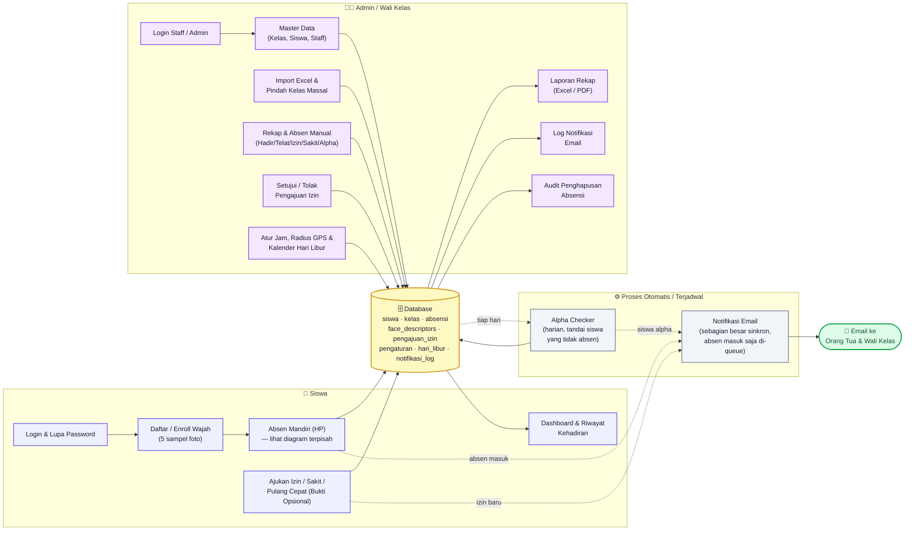

# Bahan Slide — Peta Alur Lengkap Aplikasi
### Pelengkap teknis untuk `SLIDE-PRESENTASI-ABSENSI-WAJAH.md`

> Format sama seperti file slide utama: tiap `## Slide N` = satu slide.
> Judul slide = judul di file ini, bullet di bawahnya = isi slide.
> *Catatan pembicara* tidak perlu ditulis di slide, itu pegangan saat
> presentasi. Diagram di Slide 3 disarankan di-screenshot (dari preview
> Markdown/Mermaid) lalu ditempel sebagai gambar di slide — Mermaid tidak
> otomatis tampil di PowerPoint/Google Slides.
>
> Untuk alur detail absen mandiri siswa (langkah demi langkah, termasuk
> liveness & lokasi), lihat file terpisah **ALUR-DEMO-ABSEN-MANDIRI.md**.

---

## Slide 1 — Judul
**Peta Alur Lengkap Aplikasi**
- Absensi Siswa Berbasis Pengenalan Wajah
- Gambaran seluruh modul: siswa, admin/wali kelas, proses otomatis

*Catatan pembicara: slide ini pelengkap teknis, cocok dipakai kalau ada pertanyaan "aplikasinya bisa apa saja secara keseluruhan" di sesi diskusi.*

---

## Slide 2 — Kenapa Perlu Peta Ini
- Fitur aplikasi lebih banyak dari yang biasa didemokan (absen wajah bukan satu-satunya modul)
- Membantu guru melihat **keterkaitan antar fitur** — data mengalir ke satu database yang sama
- Jadi rujukan cepat saat ada pertanyaan "kalau X terjadi, sistemnya ngapain?"

---

## Slide 3 — Diagram Peta Fitur
*(Tempel screenshot diagram di sini — sumber Mermaid ada di bagian bawah file ini)*

---

## Slide 4 — Cara Membaca Diagram
- 🔵 **Biru** — aksi yang dilakukan siswa
- 🟣 **Ungu** — aksi yang dilakukan admin/wali kelas
- ⚪ **Abu-abu** — proses otomatis, tanpa interaksi manusia
- 🟡 **Kuning** — database, pusat semua data
- 🟢 **Hijau** — keluaran akhir (email notifikasi)

---

## Slide 5 — Modul: Siswa (Portal Mandiri)
- **Login & Lupa Password** — autentikasi akun siswa + opsi reset password via email/admin
- **Daftar/Enroll Wajah** — 5 sampel foto dari sudut berbeda, disimpan sebagai vektor biometrik 128 dimensi
- **Absen Mandiri (HP)** — deteksi wajah + kedip adaptif (liveness) + validasi radius GPS sekolah
- **Ajukan Izin/Sakit/Pulang Cepat** — kirim permohonan ke wali kelas dengan lampiran bukti opsional
- **Dashboard & Riwayat** — grafik rekap persen kehadiran & histori bulanan siswa

---

## Slide 6 — Modul: Admin / Wali Kelas
- **Kelola Master Data** — data kelas, siswa, serta akun staff & wali kelas
- **Import & Pindah Kelas Massal** — upload data siswa baru via Excel & fitur naik/pindah kelas sekaligus
- **Rekap & Absen Manual** — pantau kehadiran real-time & entri manual (hadir/terlambat/izin/sakit/alpha)
- **Setujui Pengajuan Izin** — review dan tanggapi (approve/reject) pengajuan izin, sakit, & pulang cepat
- **Pengaturan & Hari Libur** — jam masuk, batas telat, radius GPS sekolah, & kalender libur
- **Laporan Rekap** — cetak & unduh laporan absensi per kelas/periode dalam format Excel & PDF
- **Log Notifikasi & Audit** — pantau riwayat email terkirim & jejak audit jika ada absensi yang dihapus

*Catatan pembicara: dulu ada mode "kiosk" kamera bersama di sekolah, tapi sudah dihapus — sekarang semua absen wajah dilakukan mandiri oleh siswa di HP masing-masing (lihat Slide 5).*

---

## Slide 7 — Modul: Proses Otomatis
- **Alpha Checker** — jadwal harian otomatis menandai siswa tanpa catatan absen sebagai "alpha"
- **Notifikasi Email** — dipicu otomatis saat:
  - Siswa berhasil absen masuk (email ke Orang Tua) — diproses **di belakang layar (queue)**, tidak menahan proses siswa
  - Siswa dinyatakan Alpha (email ke Orang Tua) — dikirim langsung saat Alpha Checker jalan
  - Siswa mengajukan izin baru (email ke Wali Kelas) — dikirim langsung saat pengajuan disimpan
- Persetujuan/penolakan pengajuan izin **belum** memicu email ke orang tua — admin/wali kelas cukup melihat statusnya lewat halaman pengajuan izin siswa

*Catatan pembicara: tekankan ini semua berjalan tanpa perlu ada yang menekan tombol — sistem yang bekerja otomatis di background.*

---

## Slide 8 — Catatan Penting
- **Absen wajah cuma satu jalur**: mandiri lewat HP siswa sendiri — tidak ada lagi kamera kiosk bersama di sekolah
- Semua email notifikasi membutuhkan **queue worker berjalan** di server agar terkirim tepat waktu
- Diagram ini adalah peta fitur komprehensif — untuk alur teknis langkah demi langkah absen mandiri, rujuk dokumen terpisah `ALUR-DEMO-ABSEN-MANDIRI.md`

*Catatan pembicara: ada satu field "simulasi waktu" di halaman Pengaturan yang sengaja tidak dimasukkan ke daftar fitur — itu murni alat bantu development/testing (mempercepat pengujian alur berbasis jam tanpa menunggu waktu asli), bukan fitur untuk pemakaian nyata di sekolah. Kalau guru menemukan/menanyakan field itu saat demo, cukup jelaskan itu bukan bagian dari alur produksi.*

---

*(Sumber Mermaid dari Slide 3 tersimpan langsung di file `.md` ini — buka di editor yang mendukung preview Mermaid, mis. VS Code, untuk render & screenshot ulang kalau perlu.)*
