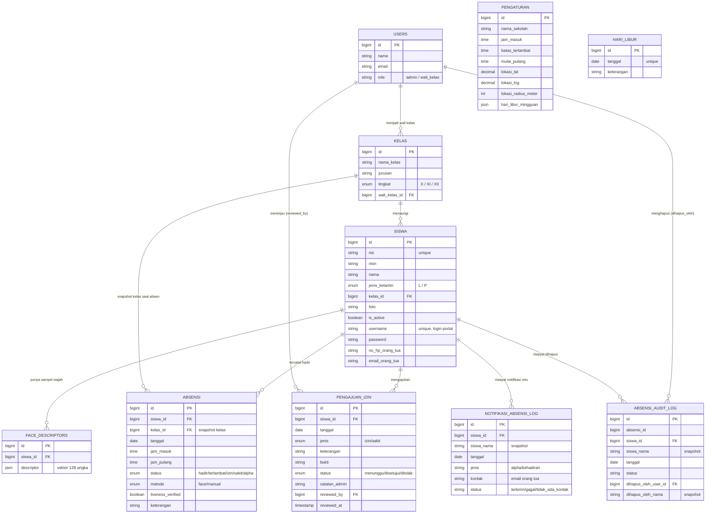

# LAPORAN APLIKASI ABSENSI SISWA BERBASIS PENGENALAN WAJAH

### (Face Recognition Attendance System)

**Nama Sekolah:** [SMKN 1 SINDANG]
**Disusun oleh:** [1. dd
2. dd]
**Tahun:** 2026

> Catatan konversi ke Word: dokumen ini ditulis dengan heading Markdown (`#`, `##`, `###`) supaya saat di-paste/import ke Word, gaya "Heading 1/2/3" otomatis terpasang dan Daftar Isi bisa dibuat otomatis (References → Table of Contents). Bagian ERD memakai kode **Mermaid** — render dulu di https://mermaid.live, lalu screenshot/export gambar untuk ditempel ke Word, karena Word tidak merender Mermaid secara native.

---

## DAFTAR ISI

_(gunakan fitur "Table of Contents" otomatis di Word setelah heading di atas diformat sebagai Heading 1/2/3)_

---

## BAB I. PENDAHULUAN

### 1.1 Latar Belakang

Proses absensi siswa yang masih dilakukan secara manual — tanda tangan di kertas, panggilan nama satu per satu, atau pencatatan oleh guru di buku — memiliki beberapa kelemahan yang berdampak langsung pada akurasi data dan efisiensi waktu belajar:

-   **Rawan kecurangan**, seperti titip tanda tangan/titip absen antarsiswa.
-   **Rawan human error**, salah tulis nama, salah kelas, atau data tercecer.
-   **Memakan waktu kegiatan belajar**, terutama di kelas dengan jumlah siswa besar.
-   **Rekap dan laporan bulanan memakan waktu lama** karena harus dipindahkan dari catatan manual ke format digital untuk dilaporkan ke pihak sekolah/dinas maupun orang tua.
-   **Keterlambatan mendeteksi siswa yang tidak hadir tanpa keterangan (alpha)**, sehingga orang tua sering tidak mengetahui anaknya tidak masuk sekolah pada hari yang sama.

### 1.2 Urgensi Pembuatan Aplikasi

Kebutuhan atas sistem absensi yang **otomatis, akurat, dan real-time** menjadi semakin mendesak karena beberapa alasan berikut:

1. **Validitas data kehadiran** — pengenalan wajah memastikan siswa yang absen adalah siswa yang benar-benar hadir secara fisik, bukan sekadar tanda tangan yang bisa dititipkan.
2. **Efisiensi waktu** — siswa dapat absen mandiri hanya dengan menghadap kamera di HP/laptop masing-masing, tanpa mengganggu jam pelajaran atau mengantre di satu titik.
3. **Kecepatan pelaporan** — wali kelas dan admin tidak perlu lagi merekap manual; laporan periode dapat diunduh langsung dalam format Excel maupun PDF.
4. **Keterlibatan orang tua** — notifikasi otomatis dikirim ke email orang tua/wali setiap kali siswa tiba di sekolah (absen masuk) maupun saat siswa tidak hadir tanpa keterangan (alpha) sampai akhir hari, sehingga orang tua dapat segera mengetahui dan menindaklanjuti.
5. **Akuntabilitas data** — setiap perubahan/penghapusan data absensi tercatat dalam jejak audit (audit trail), sehingga riwayat tidak bisa "dihilangkan" begitu saja tanpa jejak.
6. **Validasi lokasi (opsional)** — sekolah dapat memastikan siswa benar-benar absen dari area sekolah menggunakan verifikasi GPS, mencegah absen jarak jauh dari luar sekolah.

### 1.3 Tujuan

1. Mengotomatisasi proses pencatatan kehadiran siswa menggunakan teknologi pengenalan wajah.
2. Mengurangi praktik kecurangan absensi dibanding sistem manual.
3. Menyediakan rekap dan laporan kehadiran yang siap diekspor (Excel/PDF) untuk kebutuhan administrasi sekolah.
4. Memberikan admin dan wali kelas kontrol penuh atas data kelas, siswa, jam masuk/terlambat, hari libur, dan verifikasi izin/sakit siswa.
5. Meningkatkan keterlibatan orang tua melalui notifikasi otomatis saat siswa tidak hadir tanpa keterangan.
6. Menyediakan jejak audit atas seluruh perubahan data absensi untuk kebutuhan akuntabilitas.

### 1.4 Manfaat

| Bagi                  | Manfaat                                                                                                  |
| --------------------- | -------------------------------------------------------------------------------------------------------- |
| **Sekolah/Manajemen** | Data kehadiran lebih valid & akurat, laporan periodik siap pakai, mengurangi beban administratif         |
| **Wali Kelas**        | Pantauan kehadiran kelas binaan secara real-time, proses approve izin/sakit lebih cepat & terdokumentasi |
| **Siswa**             | Proses absen cepat & mandiri (tidak perlu mengantre), bisa memantau riwayat kehadiran sendiri            |
| **Orang Tua**         | Mendapat notifikasi otomatis bila anak tidak hadir tanpa keterangan pada hari yang sama                  |

### 1.5 Ruang Lingkup

Aplikasi ini mencakup: manajemen data kelas & siswa, pendaftaran wajah siswa, absensi mandiri berbasis pengenalan wajah (dengan opsi verifikasi lokasi GPS), pengajuan & approval izin/sakit daring, pengelolaan hari libur (manual & mingguan otomatis), rekap dan pelaporan kehadiran (termasuk ekspor Excel/PDF), notifikasi otomatis ke orang tua, serta audit trail perubahan data absensi. Di luar ruang lingkup: sistem penilaian akademik, jadwal pelajaran, dan modul keuangan sekolah.

---

## BAB II. DESKRIPSI APLIKASI

### 2.1 Gambaran Umum

**Absensi Wajah** adalah aplikasi web berbasis **Laravel** yang mencatat kehadiran siswa menggunakan **pengenalan wajah (face recognition)**. Berbeda dari sistem kiosk konvensional yang memerlukan satu perangkat kamera bersama di depan gerbang/kelas, aplikasi ini menerapkan model **portal mandiri (self-service)**: setiap siswa mendaftar sendiri, merekam sampel wajahnya via webcam/kamera HP, lalu melakukan absen mandiri kapan pun dari perangkat masing-masing selama masih dalam jam yang ditentukan sekolah.

Seluruh proses deteksi dan pencocokan wajah berjalan **di sisi browser (client-side)** menggunakan library `@vladmandic/face-api` (berbasis TensorFlow.js) — server Laravel **tidak pernah** menerima atau mengolah gambar wajah secara langsung, hanya menyimpan hasil ekstraksi berupa _descriptor_ (vektor 128 angka) yang tidak dapat dikembalikan menjadi foto.

### 2.2 Pengguna & Peran

Sistem memiliki dua "sisi" login yang terpisah (dua guard autentikasi berbeda):

| Peran          | Sisi Login               | Hak Akses                                                                            |
| -------------- | ------------------------ | ------------------------------------------------------------------------------------ |
| **Admin**      | Staf (`/`)               | Akses penuh: kelas, siswa, pengaturan, hari libur, akun staf, audit log, notifikasi  |
| **Wali Kelas** | Staf (`/`)               | Akses terbatas ke kelas binaannya: rekap absensi, approve/reject izin-sakit, laporan |
| **Siswa**      | Portal siswa (`/portal`) | Registrasi mandiri, daftar wajah, absen mandiri, riwayat, ajukan izin/sakit          |

### 2.3 Arsitektur Sistem

Prinsip utama: **pemisahan tanggung jawab** antara browser dan server.

-   **Browser (sisi klien)** — menjalankan seluruh proses machine learning: deteksi wajah, ekstraksi _descriptor_, dan pencocokan (`FaceMatcher`, ambang jarak Euclidean `0.5`).
-   **Server (Laravel)** — hanya menyimpan data numerik descriptor dan mencatat/memvalidasi kehadiran (cek duplikasi, cek jam masuk vs batas terlambat, cek radius GPS bila diaktifkan).

**Keuntungan:** beban komputasi ML berada di perangkat siswa sendiri, sehingga server tetap ringan dan tidak memerlukan infrastruktur GPU/ML khusus.

### 2.4 Teknologi yang Digunakan

| Lapisan           | Teknologi                                           |
| ----------------- | --------------------------------------------------- |
| Backend Framework | Laravel 12 (PHP 8.2+)                               |
| Basis Data        | MySQL                                               |
| Autentikasi Staf  | Laravel Breeze (guard `web`)                        |
| Autentikasi Siswa | Guard kustom terpisah (`siswa`)                     |
| Frontend          | Blade + Tailwind CSS + Alpine.js                    |
| Build Tool        | Vite                                                |
| Pengenalan Wajah  | `@vladmandic/face-api` (client-side, TensorFlow.js) |
| Peta Lokasi (GPS) | Leaflet                                             |
| Ekspor Excel      | `openspout/openspout`                               |
| Ekspor PDF        | `barryvdh/laravel-dompdf`                           |
| Backup Otomatis   | `spatie/laravel-backup`                             |
| Pengujian         | PHPUnit (smoke test alur absensi & self-service)    |

---

## BAB III. RANCANGAN BASIS DATA (ERD)

### 3.1 Daftar Entitas Utama

| Entitas                  | Fungsi                                                                                |
| ------------------------ | ------------------------------------------------------------------------------------- |
| `users`                  | Akun staf (admin / wali kelas)                                                        |
| `kelas`                  | Data rombongan belajar, terhubung ke wali kelas                                       |
| `siswa`                  | Data induk siswa + kredensial login portal mandiri                                    |
| `face_descriptors`       | Sampel vektor wajah siswa (banyak baris per siswa)                                    |
| `absensi`                | Catatan kehadiran harian siswa                                                        |
| `pengajuan_izin`         | Pengajuan izin/sakit siswa beserta status approval                                    |
| `pengaturan`             | Konfigurasi sekolah (baris tunggal): jam masuk, lokasi GPS, hari libur mingguan, dst. |
| `hari_libur`             | Tanggal libur manual (per tanggal)                                                    |
| `absensi_audit_log`      | Jejak audit absensi yang dihapus                                                      |
| `notifikasi_absensi_log` | Jejak pengiriman notifikasi ke orang tua                                              |

### 3.2 Diagram ERD (Mermaid)

### 3.3 Catatan Relasi Penting

-   `absensi` menyimpan `kelas_id` sebagai **snapshot** (bukan join langsung ke `siswa.kelas_id`), sehingga laporan historis per kelas tidak berubah walau siswa dipindah kelas di kemudian hari.
-   `absensi_audit_log` dan `notifikasi_absensi_log` menyimpan **nama siswa sebagai teks** (bukan hanya foreign key), agar riwayat tetap terbaca meski data siswa aslinya sudah dihapus.
-   Constraint unik `(siswa_id, tanggal)` pada `absensi` dan `pengajuan_izin` memastikan satu siswa hanya punya satu catatan per hari.

---

## BAB IV. FITUR-FITUR APLIKASI

### 4.1 Modul Admin & Wali Kelas

1. **Manajemen Kelas** — tambah/ubah/hapus rombel, penetapan wali kelas.
2. **Manajemen Siswa** — CRUD data siswa, **impor massal via Excel** (dengan template unduhan), **pindah kelas** (per-siswa maupun bulk/massal), reset akun siswa.
3. **Pendaftaran/Manajemen Wajah Siswa** — admin dapat merekam maupun menghapus sampel wajah siswa.
4. **Rekap Absensi Harian** — filter tanggal & kelas, input manual (hadir/izin/sakit/alpha) untuk kondisi offline, hapus data absensi (dengan konfirmasi & tercatat di audit log).
5. **Pengajuan Izin/Sakit** — daftar pengajuan dari siswa lengkap dengan bukti (foto/dokumen), tombol **approve/reject** dengan catatan.
6. **Laporan Periode** — filter rentang tanggal & kelas, **ekspor Excel (.xlsx)** dan **PDF**.
7. **Pengaturan Sekolah** _(khusus admin)_ — nama sekolah, jam masuk, batas terlambat, mulai jam pulang, simulasi waktu (untuk testing), lokasi & radius GPS sekolah.
8. **Hari Libur** _(khusus admin)_ — tanggal libur manual (rentang), serta **libur mingguan otomatis** (misal Sabtu & Minggu dicentang sekali, berlaku terus tanpa perlu ditambah manual tiap minggu).
9. **Audit Log Absensi** _(khusus admin)_ — riwayat lengkap data absensi yang pernah dihapus: siapa menghapus, kapan, dan data apa.
10. **Log Notifikasi Orang Tua** _(khusus admin)_ — riwayat pengiriman notifikasi alpha ke orang tua (terkirim/gagal/tidak ada kontak).
11. **Manajemen Akun Staf** _(khusus admin)_ — kelola akun admin/wali kelas lain.
12. **Dashboard Ringkasan** — total siswa, kelas, siswa yang sudah daftar wajah, jumlah hadir/terlambat/izin-sakit hari ini, daftar absen terbaru, serta **grafik tren kehadiran 7 hari terakhir**. Wali kelas melihat roster lengkap kelas binaannya beserta status absen hari ini.

### 4.2 Modul Portal Siswa Mandiri (`/portal`)

1. **Registrasi Mandiri** — siswa mengklaim NIS yang telah didaftarkan admin, lalu membuat username & password sendiri.
2. **Pendaftaran Wajah** — siswa merekam beberapa sampel wajah sendiri lewat webcam/kamera HP.
3. **Absen Mandiri** — siswa menghadap kamera dari perangkat masing-masing; sistem otomatis mendeteksi & mencocokkan wajah, mencatat **jam masuk** (status hadir/terlambat) dan **jam pulang** secara otomatis. Sistem mensyaratkan siswa **berkedip** di depan kamera sebelum absen tercatat (liveness check), agar foto statis di layar HP tidak bisa mengelabui sistem.
4. **Verifikasi Lokasi GPS (opsional)** — bila diaktifkan admin, browser akan meminta izin lokasi dan menolak absen jika siswa berada di luar radius sekolah yang dikonfigurasi. Admin menentukan titik & radius sekolah lewat **peta interaktif** (klik peta / seret pin / tombol "gunakan lokasi saat ini"), bukan input koordinat manual.
5. **Ajukan Izin/Sakit** — siswa mengunggah bukti (misalnya surat/foto) beserta keterangan, menunggu approval wali kelas/admin.
6. **Riwayat Kehadiran** — siswa dapat melihat rekap kehadiran & hari libur bulanan miliknya sendiri.
7. **Manajemen Profil/Password** — siswa dapat mengubah password akun portalnya.

### 4.3 Fitur Otomatis (Background/Terjadwal)

1. **Penandaan Alpha Otomatis** — siswa yang belum absen sampai akhir hari (dan bukan hari libur) otomatis ditandai _alpha_.
2. **Notifikasi Email ke Orang Tua** — terkirim otomatis di dua momen: (a) **konfirmasi kehadiran**, setiap kali siswa absen masuk (agar orang tua tahu anaknya sudah tiba), dan (b) **peringatan alpha**, saat siswa tidak absen sama sekali sampai akhir hari — keduanya hanya terkirim jika email orang tua sudah didaftarkan, dan tercatat di log notifikasi.
3. **Notifikasi Email ke Wali Kelas** — terkirim otomatis setiap kali siswa di kelas binaannya mengajukan izin/sakit baru, agar wali kelas cepat tahu tanpa harus mengecek halaman pengajuan izin secara manual.
4. **Backup Database Otomatis** — dump database + foto siswa terjadwal setiap hari (`spatie/laravel-backup`).

---

## BAB V. ALUR PENGGUNAAN

### 5.1 Alur Admin/Wali Kelas (Setup Awal)

1. **Kelas** → tambah kelas/rombel.
2. **Siswa** → tambah siswa satu-satu atau impor Excel (NIS, nama, kelas, opsional kontak orang tua).
3. **Pengaturan** → atur jam masuk, batas terlambat, mulai pulang, opsional lokasi GPS sekolah.
4. **Hari Libur** → tambah tanggal libur manual dan/atau centang hari libur mingguan.
5. **Rekap/Laporan** → pantau kehadiran, input manual bila perlu, ekspor laporan.

### 5.2 Alur Siswa (Harian)

1. **Registrasi** (sekali saja) → klaim NIS, buat username & password.
2. **Daftar Wajah** (sekali saja) → rekam beberapa sampel wajah.
3. **Absen** (setiap hari) → buka halaman absen, hadapkan wajah ke kamera → kehadiran tercatat otomatis (masuk & pulang).
4. **Riwayat** → cek rekap kehadiran & hari libur bulanan.
5. Jika berhalangan hadir → **ajukan izin/sakit** dengan bukti, tunggu approval wali kelas.

### 5.3 Alur Otomatis Akhir Hari

Sistem memeriksa siswa yang belum absen pada hari sekolah (bukan hari libur) → ditandai **alpha** → jika email orang tua terdaftar, notifikasi otomatis dikirim.

---

## BAB VI. KEAMANAN, PRIVASI & KETERBATASAN

| Aspek                 | Keterangan                                                                                                                                                                                                                                                                                                    |
| --------------------- | ------------------------------------------------------------------------------------------------------------------------------------------------------------------------------------------------------------------------------------------------------------------------------------------------------------- |
| **Data biometrik**    | Yang disimpan adalah _descriptor_ (vektor angka), bukan foto wajah utuh — namun tetap tergolong data pribadi sensitif dan perlu perlakuan sesuai kaidah pelindungan data pribadi.                                                                                                                             |
| **Anti-spoofing**     | Sudah ada verifikasi **liveness berbasis kedipan mata** (Eye Aspect Ratio) — siswa wajib berkedip di depan kamera sebelum absen tercatat, sehingga foto statis di layar HP tidak lolos. Belum ada deteksi gerakan kepala/kedalaman wajah (3D), sehingga video rekaman canggih secara teori masih berisiko — cukup memadai untuk lingkungan sekolah yang terawasi, belum untuk kebutuhan keamanan tingkat tinggi. |
| **Kebutuhan HTTPS**   | Kamera browser (`getUserMedia`) hanya aktif di `localhost` atau melalui koneksi HTTPS — kebijakan standar browser modern, bukan keterbatasan aplikasi.                                                                                                                                                        |
| **Duplikasi absensi** | Dicegah berlapis: constraint unik di basis data (`siswa_id` + `tanggal`) dan validasi logika di server.                                                                                                                                                                                                       |
| **Audit trail**       | Setiap absensi yang dihapus tetap tercatat siapa & kapan menghapusnya, meski baris aslinya sudah hilang dari rekap.                                                                                                                                                                                           |
| **Pemisahan akses**   | Login staf dan login siswa memakai sistem autentikasi yang benar-benar terpisah (guard berbeda), sehingga siswa tidak bisa mengakses area admin/wali kelas.                                                                                                                                                   |

---

## BAB VII. RENCANA PENGEMBANGAN LANJUTAN

1. **Notifikasi via WhatsApp** sebagai kanal tambahan/pengganti email ke orang tua (kolom nomor WA sudah tersedia di basis data, menunggu pemilihan penyedia API).
2. **Liveness detection yang lebih kuat** — deteksi kedipan mata (Eye Aspect Ratio) sudah berjalan; pengembangan lanjutan dapat menambah deteksi gerakan kepala atau pola tantangan acak (challenge-response) untuk menutup celah video/deepfake yang lebih canggih.
3. **Dashboard statistik lanjutan** — tren 7 hari & ringkasan harian sudah tersedia; dapat dikembangkan menjadi perbandingan antar kelas, rentang periode custom, dan grafik yang bisa diekspor untuk laporan evaluasi sekolah.

---

## BAB VIII. PENUTUP

Aplikasi Absensi Wajah ini berhasil mengotomatisasi proses pencatatan kehadiran siswa melalui teknologi pengenalan wajah yang berjalan di sisi klien, sehingga server tetap ringan namun data kehadiran tetap tervalidasi secara ketat di sisi backend (anti-duplikasi, validasi jam, opsi validasi lokasi & liveness). Dengan tambahan fitur portal mandiri siswa, verifikasi lokasi GPS lewat peta interaktif, deteksi kedipan mata anti-foto, pengelolaan hari libur otomatis, notifikasi orang tua, dashboard statistik, serta audit trail, aplikasi ini diharapkan dapat menjadi solusi absensi sekolah yang **akurat, efisien, dan akuntabel**, sekaligus membuka ruang pengembangan lanjutan seperti integrasi WhatsApp dan penguatan liveness detection di masa depan.

---

_Laporan ini disusun berdasarkan eksplorasi kode sumber, struktur basis data, dan dokumentasi teknis (README.md) aplikasi._
